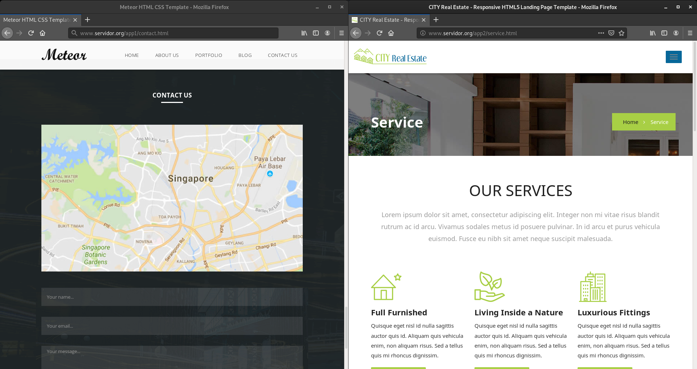

# Proxy inverso

Para hacer esta práctica vamos a utilizar el siguiente [escenario](https://fp.josedomingo.org/serviciosgs/u08/doc/haproxy/vagrant.zip) en vagrant.

En este caso queremos instalar dos servidores web en el apache1 y en apache2, estos servidores deben servir una web completa (con hoja de estilo, imágenes,…) busca alguna plantilla (debe tener algunas páginas html para probar los enlaces).

Configura en el ordenador balanceador (tienes que detener haproxy) un proxy inverso para acceder a las aplicaciones de dos formas distintas:

## Tarea 1

Para que se acceda a la primera aplicación con la URL `www.app1.org` y a la segunda aplicación con la URL `www.app2.org`.

Tenemos que parar haproxy porque da conflicto con nginx y no nos dejará reiniciar el servicio. 
~~~
sudo systemctl stop haproxy
~~~

Instalamos el paquete de `nginx` en la máquina **balanceador**.
~~~
sudo apt install nginx
~~~

Ahora vamos a hacer que la máquina **apache1** y **apache2** escuchen por el puerto 8080 modificando el Virtualhost de cada servidor web de cada máquina.

Modificamos el fichero `/etc/apache2/sites-available/000-default.conf` la siguiente linea:

~~~
<VirtualHost *:80>
~~~

por esta otra:

~~~
<VirtualHost *:8080>
~~~

También en el fichero ` /etc/apache2/ports.conf` cambiamos la linea:
~~~
Listen 80
~~~

por esta:

~~~
Listen 8080
~~~

Añadimos en el Documentroot de cada máquina una página estática de internet, nosotros vamos a utilizar [esta](https://www.free-css.com/assets/files/free-css-templates/download/page241/meteor.zip) en la máquina **apache1** y [esta](https://www.free-css.com/assets/files/free-css-templates/download/page242/city-real-estate.zip) en la máquina apache2.

**Apache 1**
~~~
cd /var/www/html/
sudo rm *
sudo wget https://www.free-css.com/assets/files/free-css-templates/download/page241/meteor.zip
sudo apt install unzip
sudo unzip meteor.zip 
sudo mv meteor/* .
~~~

**Apache 2**

~~~
cd /var/www/html/
sudo rm *
sudo wget https://www.free-css.com/assets/files/free-css-templates/download/page242/city-real-estate.zip
sudo apt install unzip
sudo unzip city-real-estate.zip 
sudo mv city-real-estate/* .
~~~

Vamos a reiniciar los servicio de `apache2` en las dos máquina.
~~~
sudo systemctl restart apache2.service 
~~~

Vamos a configurar un Virtualhost de nginx para cada servidor web apache en la máquina **balanceador**.

Creamos los fichero `apache1` y `apache2` en `/etc/nginx/conf.d`.

**Para Máquina 1**
~~~
sudo nano /etc/nginx/conf.d/apache1.conf
~~~
Añadimos:
~~~
upstream backend1 {
    server 10.10.10.11:8080;
    keepalive 64;
}

server {
    listen 80;
    server_name www.app1.org;
    location / {
        proxy_set_header X-Forwarded-Host $host;
        proxy_set_header X-Forwarded-Server $host;
        proxy_set_header X-Forwarded-For $proxy_add_x_forwarded_for;
        proxy_pass http://backend1;
        proxy_http_version 1.1;
        proxy_pass_request_headers on;
        proxy_set_header Connection "keep-alive";
        proxy_store off;
    }
}
~~~

**Para Máquina 2**
~~~
sudo nano /etc/nginx/conf.d/apache2.conf
~~~
Añadimos:
~~~
upstream backend2 {
    server 10.10.10.22:8080;
    keepalive 64;
}

server {
    listen 80;
    server_name www.app2.org;
    location / {
        proxy_set_header X-Forwarded-Host $host;
        proxy_set_header X-Forwarded-Server $host;
        proxy_set_header X-Forwarded-For $proxy_add_x_forwarded_for;
        proxy_pass http://backend2;
        proxy_http_version 1.1;
        proxy_pass_request_headers on;
        proxy_set_header Connection "keep-alive";
        proxy_store off;
    }
}
~~~

Reiniciamos el servicio `nginx`.
~~~
sudo systemctl restart nginx.service
~~~

Ahora si no tenemos DNS vamos a añadir el registro en el `/etc/hosts`.
~~~
192.168.43.142 www.app1.org www.app2.org
~~~

Comprobamos que funciona las dos páginas.

## Tarea 2

Para que se acceda a la primera aplicación con la URL `www.servidor.org/app1` y a la segunda aplicación con la URL `www.servidor.org/app2`.

Vamos a unir los dos Virtualhost en uno solo, para eso vamos a borrar los fichero `apache1` y `apache2` y creamos `/etc/niginx/conf.d/apache1y2`.

~~~
sudo rm /etc/nginx/conf.d/apache1.conf
sudo rm /etc/nginx/conf.d/apache2.conf
sudo nano /etc/nginx/conf.d/apache1y2.conf
~~~

Añadimos:
~~~
server {
    listen 80;
    server_name www.servidor.org;

    location /app1 {
        proxy_set_header X-Forwarded-Host $host;
        proxy_set_header X-Forwarded-Server $host;
        proxy_set_header X-Forwarded-For $proxy_add_x_forwarded_for;
        proxy_pass http://10.10.10.11:8080/;
        proxy_http_version 1.1;
        proxy_pass_request_headers on;
        proxy_set_header Connection "keep-alive";
        proxy_store off;
    }
    location /app2 {
        proxy_set_header X-Forwarded-Host $host;
        proxy_set_header X-Forwarded-Server $host;
        proxy_set_header X-Forwarded-For $proxy_add_x_forwarded_for;
        proxy_pass http://10.10.10.22:8080/;
        proxy_http_version 1.1;
        proxy_pass_request_headers on;
        proxy_set_header Connection "keep-alive";
        proxy_store off;
    }
}
~~~

Reiniciamos el servicio `nginx`.
~~~
sudo systemctl restart nginx.service
~~~

Ahora si no tenemos DNS vamos a añadir el registro en el `/etc/hosts`.
~~~
192.168.43.142 www.servidor.org
~~~

