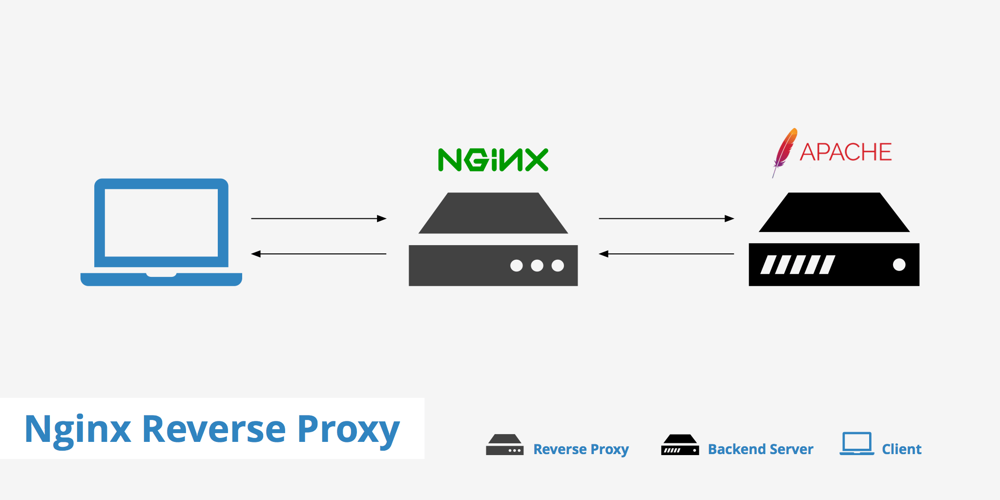

# Trabajando Proxy Inverso

Un servidor proxy es una interfaz de comunicación en una red que se hace cargo de las peticiones y las transmite en calidad de representante a un ordenador de destino. 

Vamos utilizar como proxy inverso Nginx y lo instalaremo junto a un balanceador de carga.

